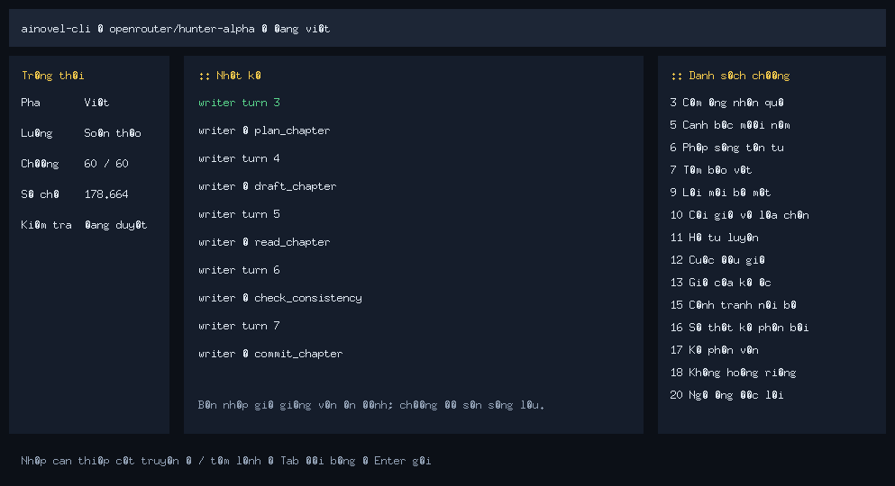
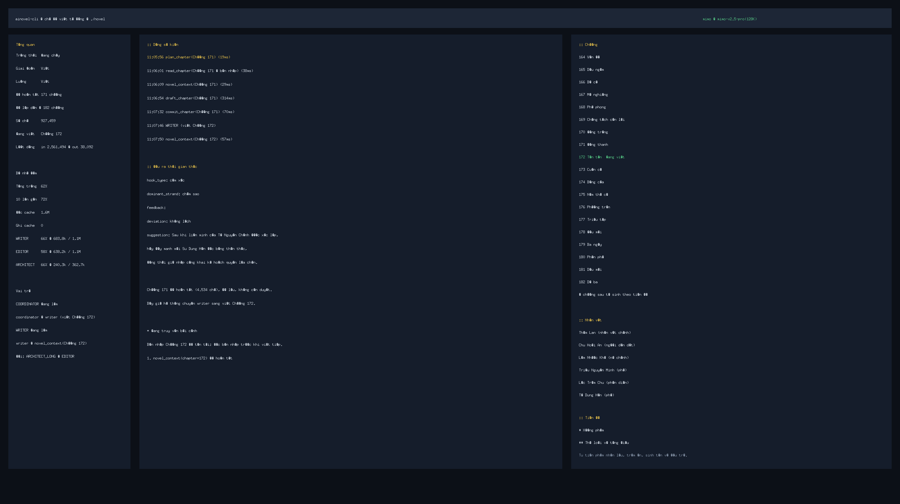

# ainovel-cli

Công cụ AI tự động hoàn toàn cho sáng tác tiểu thuyết dài. Engine xác định chạy xuyên suốt cả cuốn sách, và mô hình được dùng chính xác tại mọi điểm cần ra quyết định: Engine điều phối theo dữ kiện để dẫn dắt ba tác tử sáng tạo tự chủ Architect / Writer / Editor, còn Arbiter được đánh thức theo nhu cầu để phán quyết ngữ nghĩa. Từ một yêu cầu bằng một câu đến một cuốn tiểu thuyết hoàn chỉnh, toàn bộ quá trình không cần can thiệp thủ công.

<p align="center">
  
  
</p>

## Tính năng

- **Engine xác định + cộng tác đa tác tử** — Engine điều phối ba tác tử sáng tạo tự chủ Architect / Writer / Editor bằng bảng quyết định theo dữ kiện, vòng lặp chính không tốn LLM, hành vi có thể kiểm thử cạn kiệt
- **Phán quyết ngữ nghĩa có thể kiểm toán** — Các quyết định như chọn planner, phân luồng can thiệp, lối thoát khi thất bại đều do Arbiter thực hiện bằng một lần gọi duy nhất; mỗi phán quyết đều được ghi xuống đĩa để có thể phát lại. Càng đơn giản càng ổn định, từ chối điều phối phức tạp
- **Khôi phục theo checkpoint cấp Step** — Mỗi khi một công cụ chạy thành công sẽ ghi checkpoint; sau khi sập có thể khôi phục chính xác tới mức bước plan/draft/check/commit
- **Lập kế hoạch cuộn theo arc và volume hai lớp** — Tiểu thuyết dài không còn lập kế hoạch toàn bộ chương một lần. Ban đầu chỉ lập khung cho 2 volume đầu + chương chi tiết của arc 1, các arc/volume tiếp theo sẽ được Architect triển khai khi tiến độ viết chạm tới; mỗi lần triển khai đều tham chiếu tóm tắt phần trước và trạng thái nhân vật, nên kế hoạch dài hạn không bị rỗng
- **Gợi ý chương liên quan thông minh** — Khi viết mỗi chương, hệ thống tự động đề xuất các chương lịch sử liên quan từ bốn góc độ: manh mối, nhân vật xuất hiện, biến động trạng thái, quan hệ; kết hợp với preview chương kế tiếp để bảo đảm tính liên tục cho tiểu thuyết 500+ chương
- **Chiến lược ngữ cảnh thích ứng** — Tự động chuyển giữa toàn bộ / cửa sổ trượt / tóm tắt phân tầng theo tổng số chương, hỗ trợ tiểu thuyết 500+ chương
- **Thẩm định chất lượng bảy chiều** — Editor đánh giá từ bảy chiều: nhất quán thiết lập, hành vi nhân vật, tiết tấu, tính liền mạch tường thuật, manh mối, móc câu, chất lượng thẩm mỹ; trong đó chiều thẩm mỹ chia nhỏ thành năm mục: độ tinh xảo miêu tả / kỹ pháp kể chuyện / độ phân biệt đối thoại / chất lượng dùng từ / sức truyền cảm xúc, và mỗi mục đều phải trích dẫn nguyên văn làm bằng chứng
- **Người dùng can thiệp theo thời gian thực** — Trong quá trình viết có thể bất cứ lúc nào chèn ý kiến chỉnh sửa vào ô nhập liệu (không cần tạm dừng), hệ thống tự đánh giá phạm vi ảnh hưởng và viết lại các chương bị ảnh hưởng
- **Tùy chọn nghiệm thu từng chương** — Mặc định vẫn hoàn toàn tự động; khi cần kiểm soát chặt thì dùng `/review on`, mỗi lần `/next` chỉ cho qua một chương mới, việc làm lại và khôi phục sau sập sẽ không tiêu hao quyền cho phép sai
- **Hai đầu vào TUI + không giao diện** — Vừa có thể quan sát và can thiệp theo thời gian thực trong giao diện tương tác, vừa có thể chạy liên tục không giao diện trên server, NAS hoặc CI
- **Hỗ trợ nhiều LLM** — OpenRouter / Anthropic / Gemini / OpenAI, v.v. có thể tùy ý chuyển đổi

## Kiến trúc

Thiết kế cốt lõi: **xác định ở tầng dữ kiện, tự chủ ở tầng ngữ nghĩa**. Các chuyển trạng thái có thể liệt kê được được thực thi bằng mã xác định (Engine + Route); các phán đoán có ranh giới rõ ràng sẽ hỏi hàm LLM theo nhu cầu (Arbiter); phần sáng tạo mở giao cho vòng lặp LLM tự chủ (Workers). Tóm gọn trong một câu: một Engine xác định tuần tự, ba Worker tự chủ, một số hàm Arbiter theo nhu cầu, và một tầng dữ kiện hệ thống tệp.

```
┌─────────────────────────────────────────────────┐
│              Host / Engine (xác định)           │
│  Đọc Store → Route → chạy trực tiếp Worker → lặp  │
│  Khởi động phán quyết / phân luồng can thiệp / bế tắc thất bại → hỏi Arbiter khi cần  │
└────┬──────────┬──────────┬─────────────┬────────┘
     │          │          │             │
 ┌───▼────┐ ┌───▼───┐ ┌────▼────┐   ┌────▼────┐
 │Architect│ │Writer │ │ Editor  │   │ Arbiter │
 │(vòng LLM)│ │(vòng LLM)│ │(vòng LLM)│   │(hàm LLM)│
 └───┬────┘ └───┬───┘ └────┬────┘   └─────────┘
     └──────────┼──────────┘
                │ Gọi công cụ (IO + checkpoint)
┌───────────────▼─────────────────────────────────┐
│                   Store                         │
│  Progress / Checkpoint / Outline / Drafts / ... │
└─────────────────────────────────────────────────┘
```

- **Engine** — Mỗi vòng đọc dữ kiện từ Store, theo bảng quyết định Route để phân công Worker, thực thi quyết định, không tham gia phán đoán văn chương; khôi phục sau sập = đọc store rồi chạy tiếp, không có session để khôi phục
- **Arbiter** — Phán quyết ngữ nghĩa được đánh thức theo nhu cầu (chọn planner, phân luồng can thiệp của người dùng, lối thoát khi thất bại/bế tắc), dữ kiện đi vào, quyết định có cấu trúc đi ra, mỗi phán quyết đều được ghi xuống đĩa để có thể kiểm toán và phát lại
- **Workers** — Architect / Writer / Editor mỗi bên có context độc lập, hợp tác thông qua các artifact trong Store
- **Tools** — IO nguyên tử trên một file + phát lại idempotent; việc nộp chương dùng Saga bền vững + checkpoint, chỉ trả về JSON dữ kiện, không kèm chỉ thị

### Trách nhiệm của tác tử

| Vai trò | Trách nhiệm | Công cụ |
|--------|------|------|
| **Arbiter** | Phán quyết ngữ nghĩa: chọn planner khi khởi động, phân luồng can thiệp của người dùng, lối thoát cho thất bại/bế tắc | Không có (một lần gọi LLM, xuất quyết định có cấu trúc) |
| **Architect** | Tạo tên sách, phần giới thiệu tiểu thuyết, premise, dàn ý, hồ sơ nhân vật, quy tắc thế giới | `novel_context` `save_book` `save_foundation` |
| **Writer** | Tự chủ hoàn thành việc lên ý tưởng, viết, tự kiểm tra và nộp một chương | `novel_context` `read_chapter` `plan_chapter` `draft_chapter` `check_consistency` `commit_chapter` |
| **Editor** | Đọc nguyên văn, duyệt từ góc độ cấu trúc và thẩm mỹ | `novel_context` `read_chapter` `save_review` `save_arc_summary` `save_volume_summary` |

### Quy trình viết

```
Yêu cầu người dùng → Arbiter chọn planner → Architect lập khung + arc đầu → Writer viết từng chương → Editor review theo arc
              (phán quyết được ghi xuống đĩa)                                     ↑                   │
                                                            ├── Viết lại / trau chuốt ◄──────┘
                                                            │
                                                     Architect triển khai arc / volume tiếp theo
                                                    (tham chiếu tóm tắt phần trước + snapshot nhân vật)
```

Mỗi bước "sẽ cho ai chạy tiếp theo" được Engine suy luận theo dữ kiện Store bằng bảng quyết định Route (đã khóa bằng kiểm thử tổ hợp cạn kiệt ở quy mô hàng chục nghìn), không tốn bất kỳ LLM call nào.

Writer hoàn thành mỗi chương theo thứ tự cố định (nội dung viết hoàn toàn tự chủ, thứ tự gọi công cụ là bắt buộc):

1. `novel_context` — Tải ngữ cảnh (tóm tắt trước đó, manh mối, trạng thái nhân vật, quy tắc phong cách, các chương liên quan được gợi ý)
2. `read_chapter` — Đọc lại phần trước để tìm lại giọng điệu và tiết tấu
3. `plan_chapter` — Lên ý tưởng mục tiêu, xung đột, đường cong cảm xúc của chương
4. `draft_chapter` — Viết toàn bộ nội dung chương
5. `check_consistency` — Đối chiếu dữ liệu trạng thái để kiểm tra nhất quán (bắt buộc sau draft)
6. `commit_chapter` — Nộp bản cuối, ghi các trường dữ kiện xuống đĩa (`arc_end` / `next_chapter` / feedback pool, v.v.), bước tiếp theo do Engine suy ra theo bảng quyết định Route

### Quy tắc chuyển trạng thái

Hệ thống bên trong chia trạng thái chạy thành hai lớp:

- **Phase** — Giai đoạn lớn, biểu thị tác phẩm đang ở giai đoạn thiết lập, giai đoạn viết hay đã hoàn thành
- **Flow** — Luồng hoạt động hiện tại, biểu thị lúc này hệ thống đang viết bình thường, duyệt, viết lại, trau chuốt hay xử lý can thiệp của người dùng

#### Phase

`Phase` áp dụng quy tắc “chỉ tiến không lùi”:

```text
init -> premise -> outline -> writing -> complete
  \-------> outline ------^
  \--------------> writing
```

Ý nghĩa:

- `init` — Nhiệm vụ đã được tạo, nhưng chưa hình thành thiết lập ổn định
- `premise` — Đã lưu premise của câu chuyện
- `outline` — Đã lưu dàn ý, có thể vào giai đoạn viết chính thức
- `writing` — Đã bước vào giai đoạn sáng tác chương
- `complete` — Toàn bộ quy trình của cuốn sách đã kết thúc

Giải thích quy tắc:

- Cho phép cập nhật đồng hình, ví dụ `writing -> writing`
- Cho phép tiến lên, ví dụ `outline -> writing`
- Không cho phép lùi, ví dụ `writing -> premise`, `complete -> writing`

#### Flow

`Flow` chỉ mô tả luồng hoạt động trong giai đoạn viết, và cho phép chuyển đổi giữa vài workflow:

```text
writing   -> reviewing / rewriting / polishing / steering / writing
reviewing -> writing / rewriting / polishing / steering / reviewing
rewriting -> writing / steering / rewriting
polishing -> writing / steering / polishing
steering  -> writing / reviewing / rewriting / polishing / steering
```

Ý nghĩa:

- `writing` — Tiếp tục chương tiếp theo bình thường
- `reviewing` — Editor đang review
- `rewriting` — Xử lý các chương bắt buộc phải viết lại
- `polishing` — Xử lý các chương chỉ cần trau chuốt
- `steering` — Đang đánh giá và xử lý can thiệp của người dùng

Giải thích quy tắc:

- Cho phép `writing -> reviewing`, ví dụ sau khi nộp chương thì kích hoạt review
- Cho phép `reviewing -> rewriting/polishing/writing`, tùy kết quả review quyết định
- Cho phép `steering -> writing/reviewing/rewriting/polishing`, tùy phạm vi ảnh hưởng của can thiệp
- Không cho phép các nhảy bất thường rõ ràng, ví dụ `rewriting -> reviewing`

Các quy tắc này hiện được ràng buộc thống nhất bằng kiểm tra nhẹ trong code, tránh trạng thái lùi hoặc nhảy sang nhánh luồng không hợp lý.

### Lập kế hoạch cuộn cho tiểu thuyết dài

Giải pháp truyền thống lập kế hoạch toàn bộ chương một lần; khi lên tới 300+ chương, dàn ý trở nên rỗng, tiết tấu giống chạy tiến độ. Hệ thống này dùng **la bàn + lập kế hoạch cuộn theo tầm nhìn**, mô phỏng quy trình sáng tác thực tế của tác giả webnovel:

```
Lập kế hoạch ban đầu            Khi kết thúc arc            Khi kết thúc volume
┌────────────────────┐    ┌─────────────────────┐    ┌─────────────────────┐
│ Hướng cuối cùng (la bàn)│    │ Editor review theo arc │    │ Editor review theo volume │
│ Khởi động 2 volume, phần sau theo nhu cầu │    │ Tóm tắt arc + snapshot nhân vật │    │ Tóm tắt volume │
│ Chương chi tiết arc 1 │ →  │ Architect triển khai arc tiếp theo │ → │ Architect tự chủ tạo │
│ Nhân vật + thế giới quan │    │ Writer tiếp tục viết      │    │ volume tiếp theo + cập nhật la bàn │
└────────────────────┘    └─────────────────────┘    └─────────────────────┘
```

- **La bàn (Compass)** — Hướng cuối cùng + tuyến dài đang hoạt động + ước lượng quy mô, mỗi ranh giới volume đều do Architect cập nhật, hướng truyện có thể tiến hóa theo quá trình sáng tác
- **Sinh theo nhu cầu** — Sau khi viết xong volume hiện tại, Architect tự tạo volume tiếp theo dựa trên nội dung đã viết. Lập kế hoạch ban đầu tạo 2 volume làm điểm khởi đầu, các volume sau sinh theo nhu cầu
- **Arc khung xương** — Chỉ có goal + số chương ước tính, đến lúc chạm mới triển khai thành chương chi tiết
- **Tinh chỉnh tiến dần** — Mỗi lần triển khai đều tham chiếu tóm tắt phần trước, snapshot nhân vật, quy tắc phong cách; càng viết về sau càng chính xác
- **Mẫu tiết tấu phổ quát** — Arc trưởng thành / arc đối kháng thi đấu / arc khám phá tìm hiểu / arc ân oán xung đột / arc chuyển tiếp đời thường, mỗi loại arc có mật độ tham chiếu và ánh xạ thể loại áp dụng

### Quản lý ngữ cảnh cho tiểu thuyết dài

Tiểu thuyết 500+ chương dùng pipeline tóm tắt ba tầng + nén bốn cấp + gợi ý thông minh:

```
Volume → Tóm tắt volume
└── Arc → Tóm tắt arc + snapshot nhân vật + quy tắc phong cách
    └── Chapter → Tóm tắt chương (cửa sổ trượt 3 chương gần nhất)
```

- **Tóm tắt phân tầng** — Gần thì dùng tóm tắt chương, trung bình dùng tóm tắt arc, xa thì dùng tóm tắt volume; nén theo lớp nhưng không mất thông tin
- **Gợi ý chương liên quan** — Khi viết mỗi chương, hệ thống tra ngược các chương lịch sử từ bốn chiều: manh mối, nhân vật xuất hiện, biến động trạng thái, quan hệ, và gợi ý Writer đọc lại khi cần
- **Preview chương kế tiếp** — Nạp dàn ý chương tiếp theo, giúp Writer thiết kế móc câu cuối chương và liên kết manh mối
- **Phát hiện ranh giới arc** — Tự động nhận diện kết thúc arc/volume, kích hoạt review, tạo tóm tắt và triển khai arc/volume tiếp theo

#### Pipeline nén ngữ cảnh

Khi hội thoại vượt quá cửa sổ ngữ cảnh của mô hình, hệ thống nén theo chi phí từ thấp đến cao:

```
ToolResultMicrocompact → LightTrim → StoreSummaryCompact → FullSummary
     dọn kết quả công cụ cũ      cắt bớt văn bản dài      nén bằng store, không tốn LLM      tóm tắt LLM dự phòng
```

- **StoreSummaryCompact** — Dành riêng cho Writer, trực tiếp thay thế các message cũ bằng tóm tắt chương, snapshot nhân vật, sổ theo dõi manh mối đã có trong store, không tốn LLM
- **FullSummary tùy biến cho tiểu thuyết** — Writer dùng prompt tóm tắt hướng tới tính liên tục của tự sự, yêu cầu rõ ràng phải giữ lại trạng thái nhân vật, manh mối, mục cần sửa của bản duyệt, các mốc phong cách
- **Gói khôi phục sau nén** — Sau FullSummary tự động chèn lại kế hoạch chương hiện tại, dàn ý và snapshot nhân vật để tránh Writer bị “mất trí nhớ” sau nén
- **Cầu chì** — Khi nén thất bại liên tiếp, hệ thống tự bỏ qua và cảnh báo rõ ràng, dùng chế độ half-open, vòng sau tự thử lại
- **Ước tính token CJK** — Tiếng Trung `runes × 1.5`, sẽ không ước lượng thấp do `bytes/4` mà làm chậm kích hoạt nén
- **Gradient sức khỏe TUI** — Mức chiếm ngữ cảnh hiển thị theo thời gian thực: xanh (<70%) → vàng (70-85%) → đỏ (>85%)

## Bắt đầu nhanh

```bash
# Cài đặt một lệnh (macOS / Linux, không cần Go)
curl -fsSL https://raw.githubusercontent.com/voocel/ainovel-cli/main/scripts/install.sh | sh

# Cài đặt phiên bản chỉ định
curl -fsSL https://raw.githubusercontent.com/voocel/ainovel-cli/v1.2.3/scripts/install.sh | sh -s -- v1.2.3

# Hoặc cài qua Go
go install github.com/voocel/ainovel-cli/cmd/ainovel-cli@latest

# Xem phiên bản / cập nhật lên mới nhất
ainovel-cli --version
ainovel-cli update

# Chạy lần đầu, tự động vào quy trình hướng dẫn (chọn Provider → nhập API Key → Base URL → tên model)
ainovel-cli
```

> Windows hoặc cài đặt thủ công: vào [Releases](https://github.com/voocel/ainovel-cli/releases/latest) để tải gói phù hợp nền tảng.
> Script cài đặt sẽ tải danh sách SHA256 từ cùng một GitHub Release, chỉ giải nén và cài binary sau khi kiểm tra thành công.

### Chế độ không giao diện

`--headless` không cần TUI, phù hợp để chạy liên tục trên server, NAS, CI hoặc tác vụ nền. Chế độ này không cung cấp bước hướng dẫn cấu hình ban đầu; hãy chạy `ainovel-cli` một lần để hoàn tất cấu hình, hoặc tạo thủ công `~/.ainovel/config.json`.

```bash
# Khởi động nhiệm vụ mới bằng một yêu cầu bằng một câu
ainovel-cli --headless --prompt "Viết một tiểu thuyết dài huyền huyễn phương Đông, nhân vật chính khởi đầu từ một thị trấn nhỏ nơi biên cương"

# Đọc yêu cầu từ file
ainovel-cli --headless --prompt-file prompt.txt

# Khôi phục nhiệm vụ chưa hoàn thành trong cùng thư mục
ainovel-cli --headless
```

`--prompt` và `--prompt-file` chỉ có thể dùng trong chế độ không giao diện, và không được chỉ định đồng thời. Phần văn bản mô hình truyền trực tiếp được ghi vào stdout, các sự kiện chạy được ghi vào stderr, log vận hành đầy đủ được lưu trong `logs/headless.log` của thư mục tác phẩm.

### Docker

Ảnh Docker phù hợp để chạy các tác vụ không giao diện dài trên server/NAS, cũng có thể dùng `-it` để vào TUI. Khuyến nghị mount thư mục cấu hình và thư mục tác phẩm ra máy chủ:

```bash
mkdir -p config workspace

# TUI
docker run --rm -it \
  -v "$PWD/config:/root/.ainovel" \
  -v "$PWD/workspace:/workspace" \
  ghcr.io/voocel/ainovel-cli:latest

# Không giao diện
docker run --rm \
  -v "$PWD/config:/root/.ainovel" \
  -v "$PWD/workspace:/workspace" \
  ghcr.io/voocel/ainovel-cli:latest \
  --headless --prompt "Viết một tiểu thuyết dài huyền huyễn phương Đông, nhân vật chính khởi đầu từ một thị trấn nhỏ nơi biên cương"
```

Cũng có thể dùng Compose:

```bash
docker compose run --rm ainovel
docker compose run --rm ainovel --headless --prompt "Viết một truyện ngắn trinh thám"
```

Sau khi vào TUI, giai đoạn khởi động hỗ trợ hai kiểu tương tác tiền đề:

- `Bắt đầu nhanh`: dùng một câu để đi thẳng vào sáng tác
- `Đồng sáng tạo lập kế hoạch`: đối thoại nhiều lượt với AI để làm rõ yêu cầu, **đồng thời bên phải hiển thị bản nháp chỉ đạo sáng tác đang được hệ thống hóa theo thời gian thực**; mỗi lượt AI chủ động đưa ra 1-3 gợi ý dẫn dắt, có thể nhấn số liên tiếp để chèn, chỉnh sửa xong rồi gửi, nhấn `Ctrl+S` để vào giai đoạn sáng tác chính thức

Hai chế độ cuối cùng đều hội tụ thành cùng một bộ chỉ đạo sáng tác, rồi đi vào cùng một engine sáng tác.

Khi đã có sẵn worldbuilding hoặc dàn ý truyện khá dài, có thể tạo sách mới trực tiếp từ file ở trang chào mừng:

```text
/start ./outline.md
```

`/start` sẽ lấy toàn bộ nội dung file làm yêu cầu sáng tác ban đầu, giao cho Architect sắp xếp thành thiết lập nội bộ và dàn ý động, sẽ không coi nội dung file là các chương đã hoàn thành. Nhập một tiểu thuyết có sẵn và viết tiếp vẫn dùng `/import`.

### Quản lý nhiều cuốn tiểu thuyết

Mỗi cuốn tiểu thuyết gắn với thư mục khởi động, sản phẩm đầu ra nằm tại `{cwd}/output/novel/`. Đổi thư mục để khởi động = đổi sách, quay lại bằng `cd` rồi khởi động = tự động khôi phục từ checkpoint gần nhất. Cấu hình `~/.ainovel/config.json` được chia sẻ toàn cục, không cần sao chép.

### Tệp cấu hình

Lần chạy đầu tiên sẽ tự động hướng dẫn tạo tệp cấu hình `~/.ainovel/config.json`. Sau khi vào TUI có thể nhập `/config` để thêm hoặc chỉnh sửa Provider, lưu nhiều model và đặt cửa sổ ngữ cảnh cho từng model; sau khi lưu sẽ có hiệu lực ngay. `/model` dùng để chuyển giữa các model đã lưu này. Cũng có thể tạo thủ công tệp cấu hình, tham khảo `config.example.jsonc` ở thư mục gốc của repository. Lần khởi tạo đầu tiên cũng sẽ sao chép một bản vào `~/.ainovel/config.example.jsonc`, tiện để xem ngoại tuyến trên máy cục bộ.

```jsonc
{
  "provider": "openrouter",
  "model": "google/gemini-2.5-flash",
  "reasoning_effort": "medium",
  "providers": {
    "openrouter": {
      "api_key": "sk-or-v1-xxx",
      "base_url": "https://openrouter.ai/api/v1",
      "models": [
        { "name": "google/gemini-2.5-flash", "context_window": 200000 },
        { "name": "google/gemini-2.5-pro", "context_window": 1000000 }
      ],
      "extra": {
        "user_agent": "my-client/1.0",
        "headers": { "X-Custom-Client": "my-client" }
      }
    }
  },
  "style": "default"
}
```

#### Thứ tự tìm tệp cấu hình (mục sau ghi đè mục trước)

1. `~/.ainovel/config.json` — Cấu hình toàn cục
2. `./.ainovel/config.json` — Ghi đè cấp dự án (tùy chọn)

> `.ainovel/` cấp dự án là bản sao gương của `~/.ainovel/` toàn cục: cùng cấu trúc, chỉ đổi thư mục gốc từ thư mục home sang dự án hiện tại. Cấu hình đặt ở `./.ainovel/config.json`, quy tắc viết đặt ở `./.ainovel/rules/*.md` (xem chi tiết bên dưới “Khử mùi AI và quy tắc tùy chỉnh”). Thư mục này chứa khóa bí mật, mặc định đã được thêm vào `.gitignore`.

Giải thích quy tắc ghi đè:

- Trường vô hướng được mục sau ghi đè mục trước, ví dụ `provider`, `model`, `reasoning_effort`, `style`
- `providers` và `roles` được hợp nhất theo key, các mục trùng tên bên trong được ghi đè theo trường
- Các trường không điền sẽ kế thừa cấu hình tầng trên, ví dụ cấu hình cấp dự án chỉ viết `base_url` thì sẽ giữ lại `api_key` trong cấu hình toàn cục
- Không hỗ trợ dùng chuỗi rỗng để xóa giá trị đã có ở tầng trên; nếu cần xóa, hãy chỉnh trực tiếp tệp cấu hình có độ ưu tiên cao hơn

> ⚠️ Giá trị của `provider` (và `roles.*.provider`) là **tên key** trong `providers`——một con trỏ, không phải tên giao thức. Nếu cấp dự án chuyển `provider` sang một tài khoản không tồn tại trong `providers` toàn cục, bắt buộc phải đồng thời bổ sung thông tin xác thực của tài khoản đó ở cấp dự án (`api_key` / `base_url`), nếu không khi khởi động sẽ báo “chưa cấu hình thông tin xác thực”.

`providers.<name>.models` là danh sách đối tượng model tùy chọn: `name` là tên model truyền cho Provider, `context_window` là cửa sổ nén ngữ cảnh riêng của model, `json_schema` là ghi đè ba trạng thái cho đầu ra có cấu trúc gốc (`true` xác nhận hỗ trợ, `false` xác nhận không hỗ trợ, bỏ qua thì dùng năng lực adapter). Khi dùng proxy tùy chỉnh hoặc năng lực phụ thuộc vào model cụ thể, nên điền rõ. Mảng chuỗi phiên bản cũ vẫn đọc được, lần sau lưu qua `/config` sẽ được chuẩn hóa thành danh sách đối tượng. Nếu không cấu hình, hệ thống sẽ fallback về các model cùng Provider đã từng xuất hiện trong cấu hình.

Cửa sổ ngữ cảnh được phân giải theo thứ tự “giá trị riêng của model → `context_window` top-level cũ → registry model → fallback 200K”. Nó chỉ ảnh hưởng đến thời điểm nén ngữ cảnh cục bộ, không thay đổi giới hạn request thực tế của API từ xa.

`/config` chỉ dùng để **chỉnh sửa định nghĩa Provider** (giao thức / API Key / Base URL / thư viện model), không chịu trách nhiệm “hiện dùng model nào”——để chuyển model và cường độ suy luận, hãy dùng `/model`. Danh sách model hỗ trợ `↑↓` chọn dòng, `←→` chọn trường, `Enter` chỉnh tại chỗ model ID hoặc cửa sổ ngữ cảnh, `Delete` xóa; có thể thêm model trực tiếp ở cuối, không còn vào nhiều trang chi tiết lồng nhau. Cửa sổ có thể nhập số nguyên, `128K`, `1M`, để trống nghĩa là tự động phân giải. Khi lưu sẽ **ghi về tệp cấu hình đang có hiệu lực gần nhất**——nếu thư mục dự án có `./.ainovel/config.json` thì ghi vào đó, nếu không thì ghi vào toàn cục `~/.ainovel/config.json`——và áp dụng nóng ngay lập tức. Sửa đổi thông thường chỉ bổ sung đoạn Provider tương ứng; khi sửa model ID rõ ràng, trong cùng một lần ghi nguyên tử sẽ đồng bộ di chuyển tham chiếu top-level, role và fallback. Model đang được tham chiếu không thể xóa trực tiếp, cần chuyển đi trước trong `/model`. Nhập API Key luôn được ẩn.

API Key và Base URL trong chi tiết Provider hỗ trợ chỉnh tại chỗ, Key đã có chỉ hiển thị gợi ý đã che ở đầu/cuối; “kiểm tra kết nối” sẽ dùng bản nháp hiện tại và model đã chọn để gửi một request thực tối thiểu, có thể phát sinh một lượng nhỏ mức sử dụng API, nhưng kết quả kiểm tra sẽ không ngăn lưu hoặc kích hoạt tự động hạ cấp. Các cấu hình nâng cao tùy ý như `extra`, `extra_body`, `stream_idle_timeout` vẫn được duy trì trong tệp cấu hình thực tế hiển thị trên giao diện.

`reasoning_effort` là cường độ suy luận mặc định, các giá trị có thể chọn là `off` / `low` / `medium` / `high` / `xhigh` / `max`; bỏ qua hoặc chuỗi rỗng nghĩa là dùng mặc định của model/provider. `roles.<role>.reasoning_effort` có thể ghi đè theo role, khi chưa cấu hình thì kế thừa `reasoning_effort` top-level. Cường độ suy luận có hiệu lực theo “ý định × năng lực”: thứ lưu trong cấu hình là **ý định gốc** bạn đã chọn, khi thực sự gửi xuống sẽ được kẹp lại theo **năng lực của model hiện tại** của role đó——chuyển sang model năng lực thấp hơn chỉ làm giá trị có hiệu lực của lần đó bị kẹp thấp, ý định lưu trữ không đổi, chuyển lại model mạnh sẽ tự khôi phục. Sau khi panel TUI `/model` chuyển provider, model hoặc cường độ suy luận, nó sẽ ghi về tệp cấu hình hiện đang có hiệu lực (giống `/config`: nếu tồn tại cấp dự án thì ghi dự án, nếu không thì ghi toàn cục).

`providers.<name>.api` chỉ có hiệu lực với `type: "openai"` hoặc `openai` tích hợp sẵn, dùng để chọn OpenAI protocol endpoint: `chat` (mặc định, `base_url + /chat/completions`) hoặc `responses` (`base_url + /responses`). Nếu `base_url` đã chứa path (như `/api/v3` của Volcano Ark), path đó sẽ được giữ nguyên; khi chỉ điền domain thì mặc định dùng `/v1` của OpenAI. Proxy kiểu Codex thường cần cấu hình thành `responses`.

`providers.<name>.extra` là cấu hình cấp provider, sẽ được truyền cho HTTP client tầng dưới, phù hợp để cấu hình các trường nhận diện proxy như `user_agent`, `headers`, `anthropic_beta`; `providers.<name>.extra_body` mới là tham số mở rộng thân request, đừng dùng lẫn hai mục này.

## Báo cáo chẩn đoán

Nhập `/diag` trong TUI có thể chẩn đoán phân tích các sản phẩm output của tiểu thuyết hiện tại, tạo ra các phát hiện có thể hành động và đề xuất cải thiện.

Chẩn đoán bao phủ bốn chiều:

- **Quy trình** — Vòng lặp viết lại bị kẹt, chỉ lệnh rẽ hướng chưa được tiêu thụ, trạng thái giai đoạn/quy trình bất thường, số chương bị nhảy
- **Chất lượng** — Điểm thấp kéo dài ở các chiều đánh giá, tỷ lệ thực hiện hợp đồng, tỷ lệ viết lại, số chữ chương bất thường
- **Lập kế hoạch** — Foreshadowing đình trệ, compass lỗi thời, dàn ý cạn kiệt, thiếu tóm tắt
- **Ngữ cảnh** — Nhân vật biến mất, lỗ hổng timeline, dữ liệu quan hệ đình trệ

Mỗi phát hiện bao gồm: mô tả vấn đề, bằng chứng dữ liệu, đề xuất cải thiện (trỏ tới prompt/flow/config cụ thể).

`/diag` đồng thời sẽ ghi ra một bản `meta/diag-export.md` **đã khử nhạy cảm** (loại bỏ chính văn tiểu thuyết, chỉ giữ khung hành vi như lời gọi công cụ, chuỗi lỗi, số lần lặp). Khi gặp vấn đề kiểu vòng lặp chết / gián đoạn, chỉ cần dán nó vào GitHub issue, giúp maintainer định vị khi không có dữ liệu cục bộ.

## Hồ sơ mô phỏng phong cách

Đặt bài viết tham khảo vào thư mục `simulate/` của thư mục khởi động hiện tại, rồi nhập `/simulate` trong TUI. Hệ thống sẽ đọc đệ quy các tệp `.txt`, `.md`, `.markdown`, dùng model architect phân tích ngữ liệu, và ghi vào:

```text
output/novel/meta/simulation_profile.json
```

Khi chạy lại `/simulate`, hệ thống sẽ bỏ qua các tệp chưa thay đổi theo `relative_path + sha256`; nếu không có nội dung mới hoặc thay đổi, sẽ nhắc “hồ sơ đã là mới nhất” và không gọi LLM. Nếu đã có hồ sơ và trong `simulate/` xuất hiện bài viết mới hoặc được sửa, hệ thống sẽ tiếp tục tổng hợp trên nền hồ sơ cũ.

Cũng có thể nhập hồ sơ đã tạo trước đó để tránh phân tích lặp cùng một nhóm bài viết:

```text
/simulate
/importsim ./profile.json
```

`/importsim` chỉ chấp nhận JSON `simulation_profile.v1` do chức năng này tạo ra, và hợp nhất theo dấu vân tay ngữ liệu, nguồn trùng lặp sẽ bị bỏ qua. Chỉ nhập tệp hồ sơ từ nguồn đáng tin cậy; nội dung nhập sẽ trở thành tham chiếu ngữ cảnh cho Agent về sau. Hồ sơ sẽ được inject vào `novel_context` ở dạng compact, Architect, Writer, Editor đều đọc được; các Agent chỉ tham khảo cấu trúc, nhịp điệu, hook và thủ pháp thu hút độc giả, không sao chép cách diễn đạt nguyên văn hoặc thiết lập độc quyền.

## Tiếp nhận chỉnh sửa thủ công

Có thể chỉnh sửa trực tiếp các chương đã hoàn thành trong `output/novel/chapters/*.md`. Hệ thống nhận diện thay đổi theo SHA-256 của chính văn đã tiếp nhận, không phụ thuộc thời gian sửa tệp:

```text
/sync --check   # Chỉ liệt kê các chương đã thay đổi, không gọi model
/sync           # Tiếp nhận sửa đổi, xây lại tóm tắt, timeline, foreshadowing, quan hệ, trạng thái và ký ức phong cách
```

Khi phát hiện sửa đổi chưa được tiếp nhận, việc khôi phục sáng tác, tiếp tục nhập và `/next` đều sẽ yêu cầu rõ ràng phải chạy `/sync` trước, tránh sự thật cũ tiếp tục điều khiển chương mới. `/sync` không viết lại chính văn của người dùng; model chỉ chịu trách nhiệm trích xuất lại đầy đủ sự kiện chương và sở thích phong cách có thể tái sử dụng từ chính văn mới, phiên bản tệp, projection trạng thái và khôi phục crash đều do chương trình xử lý xác định. Các review, tóm tắt arc/volume và snapshot nhân vật bị ảnh hưởng sẽ mất hiệu lực và được Editor xây bù; thay đổi cốt truyện sẽ được giao cho Architect cập nhật kế hoạch tiếp theo trước khi viết tiếp, khi xác nhận kế hoạch gốc vẫn áp dụng cũng sẽ ghi xuống đĩa rõ ràng.

## Nhập

Nhập `/import <đường-dẫn-tệp>` trong TUI để **biên dịch ngữ nghĩa** một tiểu thuyết đã có vào dự án. Mỗi lần khởi động gắn với một cuốn sách (dưới thư mục khởi động là `output/novel`), vì vậy việc nhập thường được khởi phát trực tiếp ở **màn hình chào mừng sau khi khởi động trong thư mục mới**——nó song song với “nhập yêu cầu để bắt đầu sách mới” và “đồng sáng tạo để bắt đầu sách mới”, là cách thứ ba để khởi một cuốn sách; khi engine đang sáng tác, lệnh này sẽ bị từ chối. Pipeline tiến theo từng giai đoạn: snapshot tệp nguồn (ingest) → LLM nhận diện ranh giới chương (segment) → xác nhận chia tách → trích xuất sự kiện theo từng chương (analyze) → tổng hợp phân tầng premise toàn sách / nhân vật / thế giới quan / dàn ý phân tầng / compass (synthesize) → phát hành Foundation chính thức và ghi xuống đĩa theo từng chương (publish). Ranh giới chương do model phán định theo ngữ nghĩa, không phụ thuộc quy tắc tiêu đề hard-coded; phía Go chỉ quản tọa độ, kiểm tra phủ, idempotency và thứ tự.

Quy trình điển hình chỉ ba bước——nhập, kiểm tra, đợi hoàn thành:

```text
/import ~/tieu-thuyet-cua-toi.txt   # ① Khởi động: panel hiển thị tiến độ realtime, dừng lại sau khi chia tách xong
                         # ② Kiểm tra toàn bộ tiêu đề chương liệt kê trong panel: nhấn y để xác nhận tiếp tục
                         # ③ Tự động chạy hết phân tích→tổng hợp→phát hành, hoàn thành rồi dừng ở nghiệm thu, xác nhận không sai là có thể tiếp tục sáng tác
```

Chia tách không đúng? Đóng panel bằng Esc, dùng ngôn ngữ tự nhiên giải thích rồi nhận diện lại (sẽ lại dừng để kiểm tra):

```text
/import --guide=Ngoại truyện X cũng là chương độc lập     # Văn bản hướng dẫn có thể chứa khoảng trắng, đặt ở cuối lệnh
```

Tất cả tùy chọn (ba tùy chọn đầu sẽ được lưu bền vững, sau khôi phục crash vẫn tuân thủ):

```text
/import ~/tieu-thuyet-cua-toi.txt --yes           # Không giám sát: tự động chấp nhận chia tách và chạy hết toàn bộ quy trình
/import ~/tieu-thuyet-cua-toi.txt --story=closed  # Trả lời trước "trạng thái câu chuyện còn nghi vấn": xử lý theo đã hoàn thành (closed) / chưa hoàn thành (open)
/import ~/tieu-thuyet-cua-toi.txt --continue      # Sau khi nhập xong trực tiếp nối tiếp viết tiếp, không dừng ở nghiệm thu
/import                                # Không tham số: khôi phục phần nhập chưa hoàn thành từ chỗ gián đoạn
```

Điều kiện tiên quyết và khôi phục:

- Chỉ có thể nhập vào **sách trống** (không có chương đã hoàn thành), không hỗ trợ nhập một cuốn sách khác vào tác phẩm đã có; tệp nguồn hỗ trợ `txt`/`md`, mã hóa UTF-8 / GB18030 (tự động nhận diện, nếu không thể giải mã đáng tin cậy sẽ báo lỗi rõ ràng).
- Sản phẩm của mỗi giai đoạn nằm trong workspace `meta/import/` và được gắn theo fingerprint đầu vào: sau khi gián đoạn hoặc thất bại, chạy lại `/import` chỉ làm bù phần còn thiếu, không gọi model lặp lại, không cần nhớ “đã nhập tới chương mấy”. Khi tồn tại tác vụ nhập chưa hoàn thành, màn hình chào mừng sau khi khởi động lại sẽ chủ động nhắc tiến độ (như “đã phân tích 210/300 chương”); trước khi khôi phục hoàn tất, engine bị gate chặn, sẽ không coi bán thành phẩm là sách hoàn chỉnh để viết tiếp. Response gốc khi model xuất lỗi được lưu trong `meta/import/failures/` để tra soát.
- Khi trạng thái câu chuyện được tổng hợp phán định là `uncertain`, pipeline sẽ dừng lại, chỉ cần dùng `--story=open|closed` để chỉ rõ rồi chạy lại.
- Mặc định sau khi phát hành xong sẽ đặt một Hold nghiệm thu, đợi bạn xác nhận rồi mới viết tiếp; `--continue` bỏ qua Hold đó (ở chế độ review vẫn cần `/next`).
- Ba hàm ngữ nghĩa của nhập có thể chỉ định cấp model độc lập trong cấu hình `roles` (xem [Dùng model khác nhau theo role](#dung-model-khac-nhau-theo-role)).

> Nguyên văn sẽ được ghi nguyên chữ xuống đĩa thành chương đã hoàn thành, vì vậy nhập phù hợp để “viết tiếp cùng một cuốn sách”. Nếu chỉ muốn tham khảo thiết lập để sáng tác mới hoàn toàn, hãy khởi một cuốn sách mới bằng cách thông thường, mô tả phong cách thiết lập mong muốn trong yêu cầu.

## Xuất

Nhập `/export` trong TUI để hợp nhất xuất các chương đã hoàn thành, mặc định TXT, ghi vào `{thư-mục-tiểu-thuyết}/{tên-sách}.txt`. Xuất là thao tác chỉ đọc, giữa quá trình viết cũng có thể lấy “thành phẩm giai đoạn hiện tại” bất cứ lúc nào, không ảnh hưởng engine chạy.

Định dạng do **đuôi đường dẫn đầu ra** quyết định (`.txt` / `.epub`):

```text
/export                            # Mặc định TXT, {thư-mục-tiểu-thuyết}/{tên-sách}.txt
/export ~/dom-sang.txt                  # Đuôi .txt → TXT
/export ~/dom-sang.epub                 # Đuôi .epub → EPUB (Apple Books / WeChat Read / Kindle trình chuyển đổi đọc được)
/export from=10 to=30 --overwrite  # Khoảng chương + ghi đè
/export from=10 ~/x.epub --overwrite
```

- **TXT** — `«tên-sách»` → phân cách volume → chính văn chương (chế độ phân tầng truyện dài tự động thêm phân cách volume). Hai loại dữ liệu nội bộ **không đi vào export**: premise (bản thiết kế sáng tác, chứa thông tin hậu trường như độc giả mục tiêu / vùng cấm viết, viết cho tác giả và engine xem), phân cách arc (dưới góc nhìn độc giả, arc là cấu trúc nội bộ quá nhỏ). Exporter thống nhất tạo “Chương N Tiêu đề”; tiêu đề lặp do writer tự mang trong chính văn (`# Chương N…` hoặc `# Tên chương`) sẽ bị bóc bỏ.
- **EPUB** — Container chuẩn EPUB 3, gồm tên sách, metadata giới thiệu tiểu thuyết, trang bìa, mục lục và XHTML tách theo chương, định danh được phái sinh ổn định dựa trên nội dung (xuất lại cùng một cuốn sách sẽ được trình đọc nhận diện là phiên bản cập nhật). Không kèm ảnh bìa.

Các chương chưa hoàn thành trong phạm vi sẽ được bỏ qua và hiển thị trong kết quả, không tính là lỗi.

#### Dùng model khác nhau theo role

Thông qua trường `roles` để phân phối model khác nhau cho các agent khác nhau, role chưa cấu hình dùng model mặc định:

```jsonc
{
  "provider": "openrouter",
  "model": "google/gemini-2.5-flash",
  "reasoning_effort": "medium",
  "providers": {
    "openrouter": { "api_key": "sk-or-v1-xxx", "base_url": "https://openrouter.ai/api/v1" },
    "anthropic": { "api_key": "sk-ant-xxx" }
  },
  "roles": {
    "writer": { "provider": "anthropic", "model": "claude-sonnet-4", "reasoning_effort": "high" },
    "architect": { "provider": "openrouter", "model": "google/gemini-2.5-pro", "reasoning_effort": "low" }
  }
}
```

Các role có thể cấu hình: `architect` / `writer` / `editor`, cũng như ba cấp hàm ngữ nghĩa của pipeline nhập `import_segment` / `import_analyze` / `import_synthesize` (khi chưa cấu hình thì rơi về architect; có thể trỏ việc chia tách mang tính cơ học hơn sang model rẻ hơn để tiết kiệm chi phí). Arbiter phán định ngữ nghĩa thống nhất dùng model default, hiện không mở cấu hình role độc lập.

#### Proxy tùy chỉnh

Sau khi chọn Provider bất kỳ, chỉ cần điền địa chỉ proxy, hoặc dùng Custom Proxy và chỉ định loại API protocol. `api_key` của proxy tùy chỉnh là tùy chọn; nếu proxy của bạn không cần xác thực, có thể bỏ qua:

```jsonc
{
  "provider": "my-proxy",
  "model": "gpt-4o",
  "providers": {
    "my-proxy": {
      "type": "openai",
      "base_url": "https://proxy.example.com/v1",
      "extra": {
        "user_agent": "my-client/1.0",
        "headers": { "X-Custom-Client": "my-client" }
      }
    }
  }
}
```

Provider được hỗ trợ: `openrouter` / `anthropic` / `gemini` / `openai` / `deepseek` / `qwen` / `glm` / `grok` / `ollama` / `bedrock` và proxy tùy chỉnh bất kỳ.

Nếu proxy là giao thức Anthropic, và giới hạn chỉ cho client Claude Code truy cập, `type` nên đặt là `anthropic`, `anthropic_beta` đặt ở top-level của `extra`, các HTTP header như Stainless đặt trong `extra.headers`:

```jsonc
{
  "provider": "claude-code-proxy",
  "model": "claude-sonnet-4-6",
  "providers": {
    "claude-code-proxy": {
      "type": "anthropic",
      "api_key": "sk-xxx",
      "base_url": "https://proxy.example.com",
      "extra": {
        "user_agent": "claude-code/2.1.183",
        "anthropic_beta": "claude-code-20250219",
        "headers": {
          "X-Stainless-Lang": "js",
          "X-Stainless-Package-Version": "0.94.0",
          "X-Stainless-Runtime": "node"
        }
      }
    }
  }
}
```

Nếu proxy là giao thức OpenAI/NewAPI, và giới hạn chỉ cho client Codex truy cập, `type` nên đặt là `openai`, dùng `extra.user_agent` ghi đè mặc định `litellm-go/0.1`, đồng thời truyền xuyên suốt header nhận diện Codex trong `extra.headers`. `Session_id` và `X-Codex-Turn-Metadata` trong ví dụ nên được thay bằng giá trị ngẫu nhiên ổn định; chúng đồng thời tương thích với mẫu truyền xuyên suốt Codex của New API và kiểm tra fingerprint `x-codex-*` của sub2api:

```jsonc
{
  "provider": "codex-proxy",
  "model": "gpt-5.4",
  "providers": {
    "codex-proxy": {
      "type": "openai",
      "api_key": "sk-xxx",
      "base_url": "https://proxy.example.com/v1",
      "models": [
        { "name": "gpt-5.4", "context_window": 400000 },
        { "name": "gpt-5.4-mini" },
        { "name": "MiniMax-M3", "context_window": 1000000 }
      ],
      "api": "responses",
      "extra": {
        "user_agent": "codex-tui/0.142.3 (Mac OS 26.5.1; arm64) Apple_Terminal/470.2 (codex-tui; 0.142.3)",
        "headers": {
          "Originator": "codex-tui",
          "Session_id": "replace-with-random-session-id",
          "X-Codex-Turn-Metadata": "replace-with-random-turn-metadata"
        }
      }
    }
  }
}
```

Về `api_key`:

- `openrouter` / `anthropic` / `gemini` / `openai` / `deepseek` / `qwen` / `glm` / `grok` các API được lưu trữ kiểu này thường cần điền `api_key`
- `ollama` và `bedrock` cho phép không điền `api_key`; Bedrock cần cấu hình `region`, `access_key_id`, `secret_access_key` trong `extra` (tùy chọn `session_token`)
- Các proxy tùy chỉnh có chỉ định rõ `type` cho phép không điền `api_key`

Ví dụ cấu hình `ollama` cục bộ:

```jsonc
{
  "provider": "ollama",
  "model": "qwen3:latest",
  "providers": {
    "ollama": {
      "base_url": "http://localhost:11434/v1"
    }
  }
}
```

### Phong cách viết

Chuyển bằng trường `style` trong file cấu hình:

- `default` — phong cách thông dụng
- `suspense` — trinh thám hồi hộp
- `fantasy` — tiên hiệp kỳ ảo
- `romance` — ngôn tình

### Loại bỏ chất AI và quy tắc tùy chỉnh

Có sẵn một baseline loại bỏ chất AI (mặc định xuất xưởng): blacklist cơ học (cụm sáo / từ gây mệt, mã đã nhúng `rules.SystemDefaults()`, kiểm tra xác định khi commit) + tiêu chí ngữ nghĩa `assets/references/anti-ai-tone.md` (tiêm các né tránh và bằng chứng cho writer / editor).

Nếu muốn chồng thêm sở thích của riêng bạn thì **không cần sửa mã nguồn**: trong thư mục `~/.ainovel/rules/` (toàn cục, đặt bất kỳ `.md` nào, gộp theo thứ tự từ điển tên file) hoặc thư mục `./.ainovel/rules/` (cho cuốn sách này, cũng đặt bất kỳ `.md` nào, cùng hình thái như toàn cục), **chỉ cần viết sở thích bằng lời bình thường** (ví dụ: “nhân vật chính đừng viết thành thánh mẫu”, “dùng nhiều cảm nhận cơ thể hơn”, “mỗi chương khoảng 3000 chữ”, “đừng xuất hiện ‘ở một mức độ nào đó’”) — không format, không YAML. Hệ thống sẽ dùng mô hình để chuẩn hóa các yêu cầu ngôn ngữ tự nhiên này thành snapshot quy tắc của cuốn sách (phạm vi số chữ / từ cấm / ngưỡng từ gây mệt, v.v. các ràng buộc có cấu trúc + sở thích phong cách), khi viết sẽ tự động tuân theo, khi commit sẽ tự kiểm tra cơ học; baseline cơ học cho các cụm sáo AI thường gặp và từ gây mệt đã được tích hợp sẵn, không viết cũng dùng được, áp dụng gần nhất và cộng dồn với baseline tích hợp.

### Tùy chỉnh văn phong (Voice Layer)

Tiêu chuẩn viết và tiêu chí loại bỏ chất AI cũng có thể ghi đè trực tiếp, vẫn **không cần sửa mã nguồn, không cần biên dịch lại**. Có hai tầng thư mục ghi đè: `<thư_mục_đầu_ra>/style/` (cho cuốn sách này, đi cùng cuốn sách — đổi máy vẫn khôi phục cùng một cuốn sách và tải cùng một văn phong) > `~/.ainovel/style/` (toàn cục), cấu trúc thư mục:

```
style/
├── voice.md                          # Phần bổ sung tiêu chuẩn viết (giữ phần tích hợp sẵn, yêu cầu của bạn được nối thêm phía sau và ưu tiên cao hơn)
├── anti-ai-tone.md                   # Phần bổ sung tiêu chí loại bỏ chất AI (tương tự ở trên)
├── styles/
│   └── xianxia.md                    # Thêm phong cách tùy chỉnh mới (tên file chính là tên phong cách, dùng `style: xianxia` trong config là được)
│                                     # (cùng tên với bản tích hợp sẵn như `fantasy.md` thì sẽ thay thế toàn bộ)
└── genres/
    └── xianxia/
        └── style-references.md       # Tài liệu tham khảo thể loại cho phong cách này (thay thế toàn bộ file)
```

Ghi nhớ ngữ nghĩa: **văn bản chỉ dẫn (voice / anti-ai-tone) thì nối thêm, preset phong cách (styles / genres) thì thay thế toàn bộ file**. Mức ưu tiên của phần nối thêm là chỉ thị gửi cho mô hình; các ràng buộc cần cưỡng chế cơ học (từ cấm, số chữ) hãy viết vào thư mục rules ở trên. Thay đổi có hiệu lực sau khi khởi động lại (khôi phục điểm ngắt chính xác đến từng bước, khởi động lại không tốn chi phí). Prompt kiểu giao thức thực thi không mở cho ghi đè — bất biến cộng tác được bảo vệ bởi lớp công cụ, đó cũng là lý do bạn có thể yên tâm đổi văn phong mà không làm hỏng hệ thống. Xem chi tiết thiết kế tại `docs/voice-layer.md`.

## Cấu trúc đầu ra

Tất cả dữ liệu sáng tác (chương, dàn ý, nhân vật, tiến độ, v.v.) được lưu trong thư mục output. Khi bị gián đoạn rồi chạy lại, hệ thống sẽ tự động tiếp tục từ tiến độ lần trước. Xóa thư mục output sẽ bắt đầu sáng tác lại từ đầu.

```
output/{novel_name}/
├── book.md             # Tên sách và tóm tắt tiểu thuyết (bản chiếu có thể đọc)
├── chapters/           # Bản cuối (Markdown)
│   ├── 01.md
│   └── ...
├── summaries/          # Tóm tắt chương (JSON)
├── drafts/             # Bản nháp chương
├── reviews/            # Báo cáo thẩm định
├── timeline.jsonl      # Sự kiện dòng thời gian (nhật ký nối thêm)
├── timeline.md         # Bản chiếu có thể đọc của dòng thời gian
├── premise.md          # Tiền đề câu chuyện
├── outline.json        # Dàn ý chương phẳng (chỉ gồm các chương đã được triển khai)
├── layered_outline.json # Dàn ý phân tầng (chế độ truyện dài)
├── characters.json     # Hồ sơ nhân vật
├── world_rules.json    # Quy tắc thế giới
├── meta/
│   ├── book.json       # Nguồn sự thật duy nhất của thông tin tác phẩm
│   ├── compass.json   # La bàn hướng kết cục (chế độ truyện dài)
│   ├── progress.json   # Trạng thái tiến độ
│   ├── foreshadow.json # Sổ ghi manh mối
│   ├── state_changes.jsonl # Nhật ký nối thêm các thay đổi trạng thái nhân vật
│   ├── style_rules.json# Quy tắc phong cách viết (được trích xuất ở ranh giới arc)
│   ├── snapshots/      # Snapshot trạng thái nhân vật (truyện dài)
│   └── checkpoints.jsonl # Checkpoint cấp Step (nối thêm sau mỗi lần công cụ thành công)
```

## Khôi phục điểm ngắt

Viết một tiểu thuyết dài có thể mất hàng giờ, thậm chí hàng ngày; giữa chừng sập, mất mạng hay Ctrl+C đều là chuyện thường gặp. Hệ thống sẽ **tự động khôi phục khi chạy lại trong cùng thư mục**, không cần thao tác thủ công.

### Kịch bản khôi phục

| Thời điểm bị gián đoạn | Hành vi khôi phục |
|---|---|
| Giai đoạn lập kế hoạch (đang xây dựng thế giới quan / dàn ý) | Kiểm tra các thiết lập đã lưu, tự động bổ sung phần thiếu |
| Đang viết một chương nào đó (có nháp chưa commit) | Tiếp tục từ nháp của chính chương đó, đọc nháp hiện có rồi viết tiếp |
| Đang thẩm định | Kích hoạt lại phần đánh giá của Editor |
| Hàng đợi viết lại / mài giũa chưa được dọn hết | Tiếp tục xử lý các chương còn chờ viết lại |
| Bị gián đoạn khi bung arc / quyển (đã đánh giá xong nhưng arc tiếp theo chưa bung) | Tự động phát hiện arc / quyển khung sườn và kích hoạt Architect để bung |
| Can thiệp của người dùng chưa hoàn tất | Tiêm lại chỉ thị can thiệp của lần trước |
| Bị gián đoạn khi đang viết bình thường | Tiếp tục từ chương kế tiếp |

### Cơ chế hoạt động

Toàn bộ thành quả sáng tác đều được lưu bền vững trong thư mục `output/`. Mỗi lần công cụ thực thi thành công đều ghi checkpoint (`meta/checkpoints.jsonl`). Khi khởi động lại:

1. Đọc `progress.json` + checkpoint gần nhất + các tín hiệu đang chờ xử lý
2. Sinh lệnh khôi phục chính xác đến cấp step (ví dụ: “`chapter 7` draft đã được ghi xuống đĩa, hãy tiếp tục `check_consistency`”)
3. Engine trực tiếp tính lại tuyến chạy từ store — không có session nào cần khôi phục, checkpoint idempotent đảm bảo phát lại nhiều lần vẫn an toàn

> Việc ghi file dùng thao tác nguyên tử temp + fsync + rename, nên dù mất điện ngay trong lúc ghi cũng không làm hỏng dữ liệu đã có.

## Duyệt từng chương

Mặc định hệ thống dùng chế độ `auto` để tự sáng tác liên tục. Khi cần đọc duyệt từng chương, tránh việc trong thời gian cửa sổ duyệt mà vẫn viết tiếp chương mới, có thể bật cổng duyệt xác định:

```text
/review on   # Bật duyệt từng chương; sau khi hoàn thành công việc hiện tại, chờ trước chương mới tiếp theo
/next        # Chỉ cho phép chương tiếp theo; các bước đánh giá cần thiết và bảo trì cấu trúc arc / quyển vẫn sẽ tự động hoàn thành
/review off  # Khôi phục chế độ tự động tiến lên; nếu hiện đang tạm dừng, hãy nhập lệnh tiếp tục để khởi động Engine
```

Quyền cho phép được gắn với số chương cụ thể. Chỉ khi trạng thái khôi phục sau khi commit đã được xóa sạch và checkpoint commit đã được ghi xuống đĩa thì quyền mới được tiêu thụ, vì vậy dù tiến trình sập giữa chừng lúc commit cũng sẽ không vô tình viết thêm một chương nữa. Viết lại, mài giũa, đánh giá và bảo trì cấu trúc không được tính là “chương mới”, nên sẽ không bị cổng này chặn.

## Can thiệp thời gian thực (Steer)

Trong quá trình sáng tác, bạn có thể chèn ý kiến sửa đổi bất cứ lúc nào qua ô nhập, **không cần tạm dừng hay khởi động lại**.

### Chế độ TUI

Sau khi bắt đầu sáng tác, ô nhập ở dưới cùng sẽ tự động chuyển sang chế độ can thiệp:

```
❯ Đưa tuyến tình cảm lên trước ở chương 4, tăng thêm các màn đối đầu giữa nam nữ chính
```

Sau khi nhập và nhấn Enter, hệ thống sẽ tự động:
1. Ghi chỉ thị can thiệp vào `run.json` (dùng cho khôi phục khi sập)
2. Arbiter lập tức phân xử (truy vấn có phản hồi theo giây; các hành động mang tính điều khiển sẽ được commit an toàn ở ranh giới chương)
3. Thực thi theo phán quyết: sửa thiết lập thì giao cho Architect, viết lại chương đã có thì đưa vào hàng đợi của Editor, quy tắc viết thì ghi xuống đĩa ngay — mỗi lần phán quyết đều có thể audit và phát lại

### Ví dụ can thiệp

| Chỉ thị can thiệp | Phản hồi có thể của hệ thống |
|---|---|
| "Đổi nhân vật chính thành nữ" | Sửa thiết lập nhân vật, đánh giá xem các chương đã viết có cần viết lại không |
| "Đưa tuyến tình cảm lên trước ở chương 4" | Điều chỉnh dàn ý, có thể viết lại chương 4 và các chương sau |
| "Thêm một nhân vật phản diện" | Cập nhật hồ sơ nhân vật và quy tắc thế giới, đưa vào các chương sau |
| "Nhịp truyện quá chậm rồi, tăng tốc tiến triển" | Điều chỉnh mật độ dàn ý của các chương sau |
| "Viết đến chương 20" | Sáng tác liên tục đến khi chương 20 được commit ổn định rồi tạm dừng |

## Triết lý thiết kế

> **Tầng sự thật được xác định, tầng ngữ nghĩa được tự chủ.** Tự do của mô hình được đặt ở nơi không thể xác minh điều gì là không thể (viết gì, viết thế nào), và bị ràng buộc ở nơi có thể xác minh điều có thể (thứ tự, tính idempotent, giai đoạn).

### Tam phân, càng đơn giản càng ổn định

- **Chuyển trạng thái có thể liệt kê thì giao cho code** — “lần tới giao cho ai” là đọc sự thật rồi tra bảng (`flow.Route` là hàm thuần, hàng vạn tổ hợp đã được test bằng vét cạn), tỉ lệ lỗi tiến gần 0, không tốn chi phí LLM
- **Phán đoán có ranh giới rõ thì giao cho Arbiter** — chọn planner, phân luồng can thiệp, lối thoát khi lỗi: sự thật đi vào, quyết định có cấu trúc đi ra, kiểm tra cơ học làm lưới đỡ, mỗi lần phán quyết đều được ghi xuống đĩa và có thể phát lại
- **Sáng tạo mở thì giao cho Worker** — trong phạm vi một chương, Writer hoàn toàn tự chủ; khi công cụ thất bại thì trả về lỗi có cấu trúc và gợi ý lối thoát, để LLM tự sửa
- **Giới hạn thì hard-code, không hard-code phán đoán** — code chỉ giữ các bất biến có thể chứng minh; những lựa chọn sáng tác không thể liệt kê thì để mô hình quyết, không dùng từ khóa, ngưỡng chấm điểm hay bảng quy tắc để giả làm hiểu biết
- **Công cụ chỉ trả sự thật** — I/O nguyên tử trên một file + lỗi tường minh + phát lại idempotent; commit chương dùng Saga bền vững + checkpoint, giá trị trả về là các trường sự thật JSON (`final_verdict` / `pending_rewrites` / `arc_end`), không kèm bất kỳ chuỗi chỉ thị nào
- **Hàng rào bảo vệ sự thật, không phải hàng rào bảo vệ hành vi** — `CheckpointDeltaGuard` của Worker chỉ công nhận các thành phẩm đã ghi xuống đĩa: chưa commit mà muốn xong việc sẽ bị chặn; khi mô hình hành xử đúng thì hàng rào này gần như không tốn chi phí
- **Từ chối dàn dựng phức tạp** — không có task queue, không có policy engine. Chỉ một vòng lặp tuần tự + một bảng quyết định + vài hàm phán quyết là toàn bộ luồng điều khiển
- **Mô hình càng mạnh thì lợi ích càng lớn** — chất lượng sáng tác và phán quyết tăng tuyến tính theo việc nâng cấp mô hình; lớp vỏ xác định không cần sửa một dòng

### Vòng khép kín hoàn toàn tự động

Chỉ một câu đầu vào, cho ra cả cuốn tiểu thuyết hoàn chỉnh:

```
“Viết một tiểu thuyết trinh thám” → xây dựng thế giới quan → thiết kế nhân vật → lập dàn ý
                → viết từng chương → thẩm định chất lượng → tự động viết lại
                → tóm tắt theo arc → snapshot nhân vật → hoàn thành cả cuốn
```

- **Engine điều phối xác định** — mỗi vòng đọc tầng sự thật rồi phát theo bảng quyết định, không session, không chuyển tiếp; khôi phục khi sập = đọc store rồi chạy tiếp
- **Writer sáng tác tự chủ** — mỗi chương tự hoàn thành đầy đủ vòng plan → draft → check → commit
- **Editor thẩm định tự chủ** — phân tích xuyên chương về vấn đề cấu trúc, xuất ra phán quyết và phạm vi ảnh hưởng
- **Architect xây dựng tự chủ** — từ một yêu cầu ngắn gọn suy ra thiết lập đầy đủ, khi đến ranh giới arc / quyển sẽ tự bung kế hoạch tiếp theo (tham chiếu pool phản hồi dàn ý do Writer ghi xuống đĩa)
- **Quản lý manh mối tự động** — gieo, đẩy, thu hồi đều do Agent tự theo dõi xuyên suốt
- **Điều tiết nhịp điệu tự động** — theo dõi lịch sử tuyến kể và loại hook, tránh các chương liên tiếp có cấu trúc quá giống nhau

### Tách rời sự thật và chỉ thị

Công cụ chỉ trả sự thật, “bước tiếp theo” do Engine tính lại từ tầng sự thật mỗi vòng:

- `commit_chapter` / `save_review` ghi xuống đĩa các sự thật có cấu trúc (`final_verdict` / `pending_rewrites` / `arc_end` / pool phản hồi dàn ý), không kèm bất kỳ chuỗi `[hệ thống]` nào
- `flow.Route` đọc các sự thật như `Progress` + `Outline` để suy ra chỉ thị bước tiếp theo; mỗi thay đổi trong bảng quyết định đều phải sửa đặc tả vét cạn trước rồi mới sửa hiện thực
- Tất cả quyết định ngữ nghĩa (phán quyết) đều được ghi vào `meta/decisions.jsonl`: phục vụ audit, phát lại offline, hồi quy A/B

Nhờ vậy, chỉ thị sẽ không bị nuốt bởi chuỗi gọi lồng nhau, cũng không bị trôi trong các thành phẩm của công cụ. Sửa bug quy trình chỉ cần sửa một nhánh + một đặc tả.

## Ngăn xếp công nghệ

- **Go 1.25** — ngôn ngữ chính
- **[agentcore](https://github.com/voocel/agentcore)** — lõi Agent tối giản (tool-calling + streaming)
- **[litellm](https://github.com/voocel/litellm)** — thích ứng giao diện LLM thống nhất
- **[Bubble Tea](https://github.com/charmbracelet/bubbletea)** — khung TUI cho terminal

## Giấy phép

MIT

Dự án này tích cực tham gia và công nhận [cộng đồng linux.do](https://linux.do/).